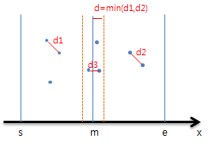
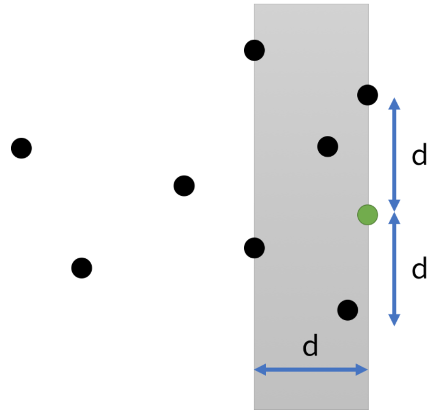

# [알고리즘]분할정복 - 백준 2261 가장 가까운 두 점 

분할정복 알고리즘을 배울 때 나오는 유명한 문제 중 하나이다. 하지만 난이도가 굉장히 높기 때문에 쉽게 접근하기 어려웠는데, 분할 정복에 남은 마지막 문제를 그냥 안풀고 넘어가기엔 마음에 걸려서 마음먹고 공부해보기로 했다.

백준 사이트에서도 검색을 추천하여 알고리즘을 공부하기를 권하기 때문에 검색을 통해 [좋은 글](https://octorbirth.tistory.com/274)을 발견했다. 그리고 해당 문제의 솔루션을 이해하는데만 집중했다. 

분할정복 문제를 반복해서 풀어보니 분할정복은 DP 만큼이나 여러가지 형태의 문제가 있으니 최대한 많은 문제들을 풀어보는 것이 중요하다는 것을 알 수 있었다. 그리고 여러 문제를 풀어 본 결과 다음을 깨달을 수 있었다. 

- 분할정복에서 분할을 하는 이유 중 하나는 **굳이 필요 없는 연산/비교 등을 하지 않기 위해서**이다. 

다르게 이야기하면 **쓸데없는 것을 쳐내기 위해서** 특정 기준에 따라서 계속 분할을 하는 것이다. [백준 2261](https://www.acmicpc.net/problem/2261) 문제를 보면 어떤 의미인지 알 수 있다. 이 사실이 나로 하여금 더 구현을 잘하게 해주지는 못하지만 *개발자 마인드*를 갖추는데 어느 정도 일조했다고 생각한다. 알고리즘 문제들을 풀면 풀수록 쌓이는 *개발자 마인드* 룰을 통해서 새로운 문제를 바라보더라도 개발자스럽게 생각해야지 적합한 알고리즘을 찾을 수 있다.

이렇게 지나지게 많은 비교 연산을 해야할 때 필요 없는 것이 무엇인지부터 접근해야 한다. 

## 문제 해결

가장 가까운 두 점 문제의 솔루션을 요약하면 다음과 같다. 

1. x값 기준으로 정렬.
2. 중간을 기준으로 왼쪽과 오른쪽을 나눔.
3. 왼쪽 가장 가까운 거리 d1, 오른쪽 가장 가까운 거리 d2 찾아냄. 
4. d1과 d2 중 더 최소값을 d 에다가 저장함. 
5. 중간으로 가로지르는 점들 중 중앙과 d 이상 차이나는 점들을 제외함.
6. 해당 점들을 y 기준으로 정렬해서 위의 점과 높이가 d 이상 차이나는 점들을 제외하여 비교하여 d3을 구함. 

위의 그림을 보면 보다 직관적으로 이해할 수 있다. 위 과정을 반복하면서 최소값을 지속적으로 업데이트하면 최종적으로 최소값을 찾을 수 있다. 

이렇게 x 값을 기준으로 정렬해서 제외한 후에, 아래 사진과 같이 y 값을 기준으로 또 정렬하여 제외시키면 된다. 

## 솔루션 구현

다음 솔루션을 구현하기 위해서 이해하거나 응용하면 좋을 개념들은 다음과 같다. 

1. JAVA comparator
2. 재귀
3. 객체 생성 

"완전히 모르는 건 아닌데?" 라고 생각하기 쉽지만 제대로 생각해보면 나는 잘 활용하지 않았던 개념들이 있었다. 예를 들어, comparator를 생성하여 정렬하기 보다 조금 돌아가지만 이전에 하던 방식으로 일일이 정렬하는 방법을 주로 사용하고, 객체를 생성하여 코드가 직관적이게 되기 보다 배열에 나만 아는 규칙으로 끼워 넣는 경우가 많았던 것 같다. 한번 이 모든 개념들을 제대로 응용해서 좋은 코드를 짜보자. 

#### JAVA Comparator 

