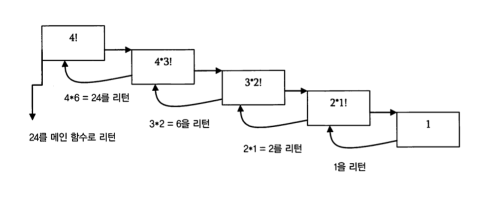

# [알고리즘] 재귀를 활용한 별 찍기

재귀는 데이터 구조를 배우는 초반에 다루는 알고리즘의 기초 중 기초이다. 모두가 다 어느 정도는 알고 있는 재귀이지만 상황에 따라 *기본 경우 와 재귀 경우*를 설정해서 생각하는 것이 쉽지 않고 그 응용분야가 매우 광범위해서 많은 문제를 풀어보는 것이 중요한 것 같다. 

그 중 [백준 별 찍기](https://www.acmicpc.net/problem/2447) 문제를 풀면서 오랜만에 재귀 문제에 대해서 깊게 고민하게 되었다. <small>나에게는 그만큼 어려웠다.. </small> 재귀는 언제나 감을 잡은 것 같으면서도 아니라는 느낌을 준다. [다음 링크](https://www.geeksforgeeks.org/recursion/)와 또 [다른 링크]([https://medium.com/@sunnkis/%EB%8D%B0%EC%9D%B4%ED%84%B0-%EA%B5%AC%EC%A1%B0-%EC%9E%AC%EA%B7%80-8d96633be4cd](https://medium.com/@sunnkis/데이터-구조-재귀-8d96633be4cd))를 참조해서 재귀에 대해서 다시 복습하고 문제도 다시 리뷰해보자. 

### 재귀란?

재귀란 자기 자신을 호출하는 방법이다. 재귀적 방법을 사용해서 문제를 풀 때, 자기 자신을 더 작은 문제로 호출해서 해결하도록 한다. 재귀는 더 많은 재귀를 만들 수 있고, 매번 원본 보다는 조금 더 단순한 형태로 재귀한다. 또한 모든 재귀의 경우는 기본 경우로 수렴해야 한다. 

즉, 재귀의 성질에 대해서 요약해 보면 다음과 같다. 

> 1. 재귀는 자기 자신을 더 단순한 형태로 호출하는 알고리즘이다.
> 2. 재귀는 재귀 경우와 기본 경우로 나뉜다.
> 3. 모든 재귀는 기본 경우로 수렴해야 한다. 
> 4. 재귀는 directly 혹은 indirectly 하게 호출될 수 있다. 


### 재귀를 응용한 문제 해결  

재귀는 주로 다음과 같은 형태를 지닌다. 

* 먼저 기본 경우 base condition에 대한 solution이 주어진다. 이 solution 은 추가적인 재귀를 하지 않는다. 

* Bigger problem의 경우에는 smaller problem으로 표현된다. 

재귀를 사용해서 문제를 해결할 때 매우 단순하게 생각하면 위와 같다. 즉, 커다란 문제를 더 작은 문제로 구성하고, 그 작은 문제가 수렴할 하나 또는 이상의 base condition을 설정한다. 재귀에서 흔히 발생하는 오류가 Stack Overflow인데 이 오류는 base condition을 설정하지 않거나 재귀가 해당 base condition으로 수렴하지 않는 경우가 있을 때 그러하다. 


### 여러 Recursion의 형태

##### Indirect Recursion 과 Direct Recursion

재귀 함수를 구현할 때 해당 재귀함수를 직접 재귀적으로 호출하는 함수를 작성할 수도 있고, 간접적으로 다른 함수 속에서 해당 함수를 재귀적으로 호출할 수 있다. 예를 들어 `a`함수 안에서 `a `함수를 호출했다면 이것을 **direct recursion**이라고 하고, `a`함수 안에 `b`함수를 호출하고 `b`함수 안에 `a`함수가 재귀적으로 있다면 이것은 **indirect recursion**이다. 

##### Tailed 과 Non-tailed Recursion

**Tailed Recursion**의 경우 함수 내에서 recursion 경우가 가장 마지막에 실행이 된다. 반대로 함수의 시작 초반에 recursion 경우가 호출이 된다면 이것이 **non-tailed recursion**이 된다. 둘 중 무엇이 더 낫거나 장단이 있는 것이 아니라, 응용 문제에 따라서 해당 문제에서 필요로 하는 경우로 나누어서 구현하면 된다. 


### Recursion에서의 memory allocation 

Main() 함수에서 호출이 되는 함수는 모두 stack에 쌓이게 되고, 그러한 함수 중 recursion 함수는 특히나 stack에 할당되어 있는 상태에서 자기 자신을 다시 호출하니 stack에 누적해서 메모리가 추가로 할당된다. 그러다가 마지막으로 호출된 recursion 함수에서 base condition을 만나 return 되면 하나씩 deallocate 하며 stack에서 빠지게 된다. 



### 재귀와 반복문 비교

##### 재귀 vs. 반복문

1. 기본 경우 일 때 종료 vs. 조건이 거짓일 때 종료
2. 스택(메모리)에 추가 공간 필요 vs. 추가 공간 필요하지 않음.
3. 무한 재귀시 stack overflow 발생 vs. 무한 반복시 추가 공간이 필요 없으므로 그저 무한 반복함

일반적으로 반복문이 재귀보다 추가적인 메모리나 호출이 필요하지 않기 때문에 더 효율적이다. 


## 별 찍기 문제해결

재귀를 응용한 문제를 한번 살펴보자. 하노이나 피보나치 수열과 같은 문제들은 재귀를 통해서 여러번 언급된 문제들이니 재귀를 이용한 [별 찍기](https://www.acmicpc.net/problem/2447)를 가지고 설명해 보려고 한다. 해당 문제는 보기에 간단해 보이지만 재귀에 대한 깊은 이해가 있어야지 해결이 가능하다. 

재귀를 사용해서 문제를 해결할 때 다음과 같은 과정을 거쳤다. 

1. 반복되는 부분 파악
2. 큰 문제 안에 작은 문제 찾기
3. base condition  찾기

위의 과정을 별 찍기 문제에 적용했을 때 다음과 같았다. 

1. 가로, 세로를 3으로 나누어 중간이 비어 있음.
2. 더 큰 정사각형은 그 전 단계의 정사각형을 하나의 단위로 가지고 있음.
3. 별 그리기.

위와 같이 3개를 모두 도출했다면 구현하는 것은 매우 간단하다. 먼저 base condition인 3)을 구현하고, 이후에 반복이 되는 1), 2)을 구현하면 된다. 


**코드:**

```java
import java.util.Scanner;
import java.util.Arrays;

public class Main{
	public static char fig[][];
	public static void main(String[] args){
		Scanner sc = new Scanner(System.in);
		int n = sc.nextInt();
		fig = new char[n][n];
		
		for(char[] row: fig){
			Arrays.fill(row, ' ');}
		drawFig(0, 0, n);

		for(char[] row: fig){
			System.out.println(row);}

		return;
	}
  
  public static void drawFig(int a, int b, int num){
    if(num==1){
      fig[a][b] = '*';
      return;
    }
    int n = num/3;
    for(int i=0;i<3;i++){
      for(int j=0;j<3;j++){
        if(i==1 && j==1)
          continue;
        drawFig((a*3)+1, (b*3)+j, n); 
      }
    }
    return;
  }
}
```


