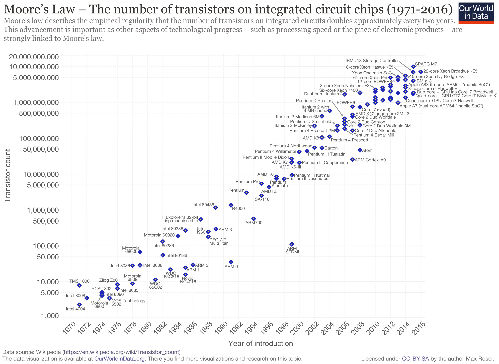
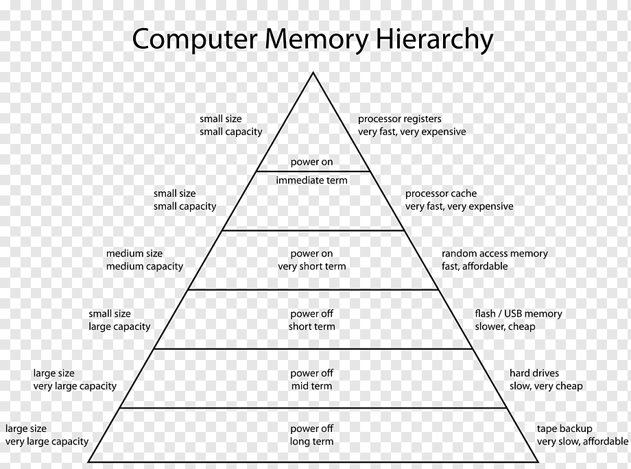

다음은 *컴퓨터 구조 및 설계*(저자: David A. Patterson, 존 헤네시) 책을 읽고 쓴 <mark>컴퓨터 구조 분야의 8가지 위대한 아이디어</mark> chapter를 읽고 요약 및 재구성한 내용이다. 

다음으로 소개할 위대한 8가지 아이디어는 빠르게 변하는 컴퓨터 분야에서 최근에 나온 아이디어는 아니지만 오래 전부터 지속적으로 컴퓨터 구조 설계에 중요한 역할을 하는 아이디어 들이다. 기본적으로 CS 관련 설계를 진행할 때 다음 아이디어들을 고려하여 설계한다. 지난 60년의 컴퓨터 역사 가운데 컴퓨터 구조 분야에서 발명된 8가지의 아이디어는 다음과 같다. 

#### 1. Moore의 법칙을 고려한 설계
**무어의 법칙**은 인텔의 설립자 Gordon Moore에 의해 소개된 법칙으로 1965년에 예측한 내용의 법칙이다. 무어의 법칙은 18~24개월마다 칩에 집적할 수 있는 transistor의 갯수가 2배씩 증가한다는 예측이다. 컴퓨터의 설계자는 프로젝트의 시작 시점과 종료 시점의 기술을 예상해야 하기 때문에, INTEL은 해당 법칙을 적용하여 전략을 설계했다. 따라서 이 법칙에 따른 칩 개발의 로드맵을 만들에 개발하고, 결과적으로 획기적인 성장을 이루어 낼 수 있었다. 이 법칙에 따라서 컴퓨터 산업은 그 성장을 예측해 왔으며 이것이 큰 원동력이 되면서 큰 영향을 미쳤다. 물론 이는 경험적인 추론으로 딱 맞아 떨어지지 않지만 이 법칙에 따른 개발의 속도를 무시할 수는 없다.

더해서 컴퓨터의 성능은 18~24개월마다 2배씩 성장할 것이며 가격은 반비례하여 반으로 줄어들 것이라고 예측하였다. 그 법칙에 따라서 발전한 컴퓨터 분야로 인해 우리의 책상 위에는 모두 하나 이상의 컴퓨터가 올라 올 수 있게 되었다. 

물론 무어의 법칙은 태생적으로 한계를 가지고 있는 법칙이었으며, 결국 발열과 밀도 등의 이유로 코어의 집적도를 높이기 어렵게 되면서 최종적으로 2016년에 무어의 법칙의 종말을 선언하였다. 하지만 '우상향'으로 증가하는 Moore 법칙 그래프로 빠른 변화를 고려한 컴퓨터 설계를 나타낼 수 있다. 

#### 2. 설계를 단순화하는 추상화
무어의 법칙에 따라서 증가하는 자원 수에 맞추어 개발을 진행하게 되면서 더욱 복잡해지는 것에 따라 설계 시간이 증가하게 되었다. 길어지는 설계 시간을 저지하기 위해서 생산성을 높이기 위한 방법이 필요했고 나온 핵심 기술 중 하나가 바로 **추상화(abstraction)**이다. 추상화란 단순히 말하자면 <mark>중요한 것은 남기고, 불필요한 것은  숨기자</mark>라는 아이디어다. 하위 수준의 상세한 사항을 숨기면서 상위 수준의 모델을 단순화 하여 이해도를 높이도록 한다. 따라서 설계를 할 때, 증가하는 복잡도에 따른 어려움을 줄일 수 있다. 

#### 3. 자주 생기는 일을 빠르게 
**자주 생기는 일을 빠르게(common case fast)** 하는 것은 드문 일을 최적화 시키는 일보다 성능 개선에 더욱 영향을 준다. 즉 설계자 혹은 개발자로서 구조나 프로그램을 설계할 때 어디에 집중해야 하는지에 대한 집중도를 알려준다. 다른 곳에 시간을 낭비하기 보다 자주 생기는 일, 많은 시간이 소요되는 곳을 최적화하고 빠르게 진행되도록 설계하자는 아이디어 이다. 즉 이것은 설계자와 개발자가 기억하고 있어야 할 중요한 우선순위를 나타낸다. 

#### 4. 병렬성을 통한 성능 개선
**병렬성** 을 한 마디로 이야기하면 큰 것을 작은 것들로 쪼개는 것으로 이야기할 수 있다. 이것은 멀티 코어에서 멀티 스레드를 작동시키는 방식으로 <mark>한개 이상의 스레드를 포함한 코어들을 동시에 실행하는 것</mark>으로 볼 수 있다. 개별 스레드에서 여러 작업이 병렬적으로 처리가 되면서 성능이 대폭 향상이 된다. 예를 들면 여러 개의 제트 엔진을 장착한 비행기로 병렬성을 설명할 수 있다. 

#### 5. 파이프라이닝을 통한 성능 개선
**파이프라이닝(pipelinig)**은 각 파이프가 조립되어서 하나의 라인이 되듯이 일을 처리하는 것을 말한다. 즉, 작은 단계로 나누어서 동시에 처리할 수 있는 부분을 동시에 처리해 처리량을 늘리는 방법이다. 이때 각 단계가 처리되는 속도는 빨리지지 않지만, 동시 처리가 가능한 작업들을 동시에 처리하면서 <mark>처리량을 늘림</mark>으로 성능을 개선한다. 파이프라이닝에 의한 속도 개선은 나누어진 단계로 계산이 된다. 즉, 4 단계로 파이프라이닝이 진행이 된다면 처리량은 4배 증가한 것이 된다. 

#### 6. 예측을 통한 성능 개선
컴퓨터 분야의 발전 속도는 기하급수적으로 빠르게 변화하고 있고, 컴퓨터 분야에서 효율적인 발전을 하려면 예측에 의한 설계 및 개발이 필요하다. **예측(prediction)**에 대한 복구 비용이 크지 않고 예측이 성공할 확률을 따져서 해당 확률이 높다면, 예측을 진행하여 미리 일을 진행하는 것이 컴퓨터 구조 설계에 더욱 유용하게 작용하곤 한다. 

#### 7. 메모리 계층구조
**메모리 계층구조**라고 함은 위로 갈수록 비싸지만 빠른 메모리, 아래로 갈 수록 싸지만 느린 메모리를 말한다. 프로그래머는 빠르지만 값이 싼 메모리를 원하므로 효율적인 메모리 설계가 필수적이다. 메모리 가격에 따라서 컴퓨터의 성능과 그 가격이 결정되므로, 이러한 상충되는 요구를 해결하기 위해서 메모리 계층구조를 사용한다. 
여러가지 방법을 통해서 메모리 구조 사용이 가능한데, 캐시를 이용하면 프로그래머에게 최상위 계층만큼 빠르고 최하위 계층 만큼 큰 메모리 사용처럼 보이게 할 수 있다. 메모리 계층 구조는 주로 다음과 같은 삼각형으로 나타내며 위의 삼각형의 좁은 부분이 빠르고 비싸며, 아래 넓은 곳으로 갈수록 크고 느리다. 

#### 8. 여유분을 이용한 신용도 개선
컴퓨터에 있어서 속도와 함께 똑같이 중요한 것이 바로 신뢰도이다. 컴퓨터의 모든 부분들을 오류나 장애가 발생할 수 있고, 장애가 발생했을 때, 심각한 결과를 초래하기 보다 장애가 난 소자나 부분에 대해서 감지하고 대처할 수 있도록 하는 것이 **컴퓨터의 신용도(dependability)**를 개선할 수 있는 방법이다. 즉, 컴퓨터 설계에 있어서 소자에 대한 여유분을 준비하여 해당 하드웨어의 기능을 지속할 수 있도록 하여 신용도를 유지하는 것이 컴퓨터 설계에 있어서 무엇보다 중요한 부분이다. 

<small>출처: https://www.britannica.com/technology/Moores-law, *컴퓨터 구조 및 설계*, https://www.geeksforgeeks.org/memory-hierarchy-design-and-its-characteristics/   </small>
